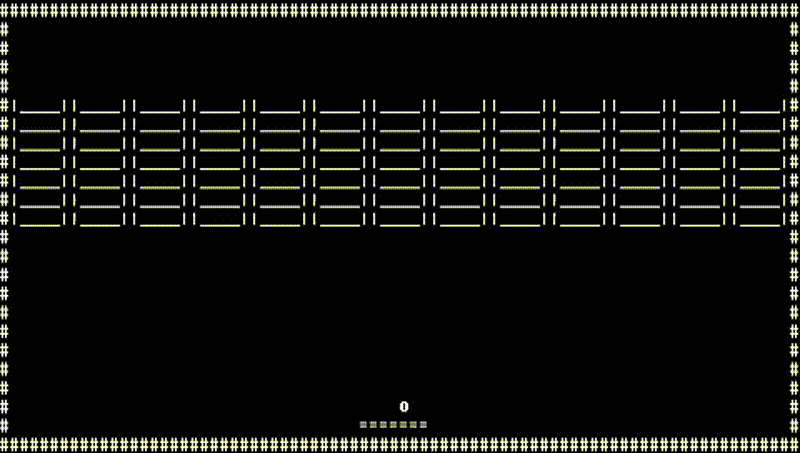

# ASCII Breakout MLX

An Apple Silicon implementation of the classic Atari 2600 game, Breakout, using ASCII characters using mlx and. This project explores how language models interpret ASCII representations of game states to generate viable gameplay actions. Inspired by [Atari-GPT](https://arxiv.org/abs/2408.15950), this approach utilizes ASCII art instead of graphical frames to represent the game state.

## Features

- ASCII-based representation of the classic Breakout game.
- Integration with language models to interpret game states and generate actions.
- Performance of Llama 3.2 3B.

## Performance

A comprehensive 1,000 step tests have been conducted using Llama 3.2 3B:

- **Llama 3.2 3B:** Demonstrated reasonable performance at the beginning but shortly started to only provide left or right actions without aligning with the ball. Here is the Gameplay:



## Installation

1. Clone the repository:

   ```
   git clone https://github.com/Dev1nW/ASCII_Breakout_MLX.git
   cd ASCII_Breakout_MLX
   ```

2. Create and activate a virtual environment:

   ```
   conda create -n ascii_breakout python=3.11
   conda activate ascii_breakout
   ```

3. Install the required dependencies:

   ```
   pip install -r requirements.txt
   ```

## Usage

1. Run the main script:

   ```
   python breakout_ascii.py
   ```

3. **Execution:**

   After selecting a model, the script will initiate a 1,000 step simulation where the chosen language model determines the gameplay actions at each step. During this process:

   - All model outputs are saved in `all_response.txt`.
   - Upon completion, a video of the performance is saved as `breakout.mp4`.
   - All actions and rewards are recorded in `actions_rewards.csv`.

## Notes

- Initial tests were conducted using Llama 3.2 1B, however, when using a 1B model it did not always follow the rule of using `<action></action>` meta-tags. I iterated over the system and user prompts however was never able to consistently get it to follow the rule until updating to the 3B model. 

- Performance is not directly comparable to Atari-GPT as the ASCII environment automatically shoots the ball without having to use a predefined action like in Atari-GPT. 


## Contributing

Contributions are welcome! If you have suggestions for improvements or new features, please open an issue or submit a pull request.

## Citing

If you find this helpful, feel free to cite as:
```
@misc{waytowich2024atarigptbenchmarkingmultimodallarge,
      title={Atari-GPT: Benchmarking Multimodal Large Language Models as Low-Level Policies in Atari Games}, 
      author={Nicholas R. Waytowich and Devin White and MD Sunbeam and Vinicius G. Goecks},
      year={2024},
      eprint={2408.15950},
      archivePrefix={arXiv},
      primaryClass={cs.AI},
      url={https://arxiv.org/abs/2408.15950}, 
}
```

